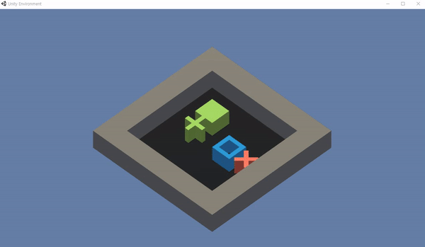
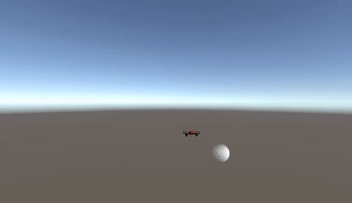
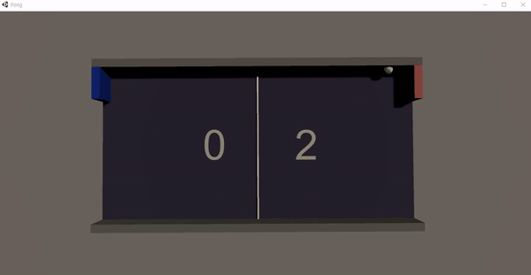
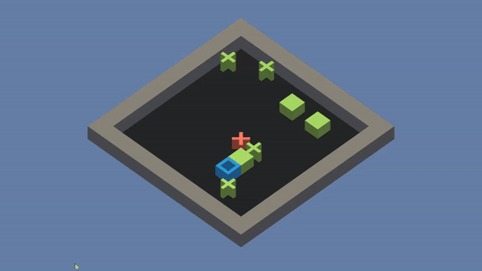
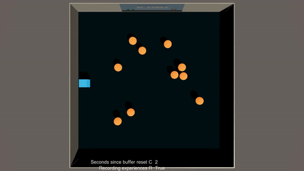

# RLKorea Unity ML-agents Tutorial Project

This is a repository for [Unity ML-agents](<https://unity3d.com/kr/machine-learning>) tutorial project of [Reinforcement Learning Korea](<https://www.facebook.com/groups/ReinforcementLearningKR/?ref=bookmarks>). This repository provides simple demo environments made by Unity ML-agents([Github](<https://github.com/Unity-Technologies/ml-agents>)). Also, there are deep reinforcement learning algorithms to train the agent in the provided environments. 

## Algorithms

All the Deep Reinforcement Learning algorithms are coded with [Python](<https://www.python.org/>) and [Tensorflow](<https://www.tensorflow.org/>). The algorithms are evaluated in Tensorflow 1.5 and above. The description of Deep Reinforcement Learning algorithms are as follows. 

1. **DQN**: Deep Q Network(DQN) algorithm([Paper](<https://web.stanford.edu/class/psych209/Readings/MnihEtAlHassibis15NatureControlDeepRL.pdf>)) for training agent in Sokoban environment.  
2. **DDPG**: Deep Deterministic Policy Gradient (DDPG) algorithm ([Paper](<https://arxiv.org/abs/1509.02971>)) for training agent in Drone environment. 
3. **DQN_Adversarial**: DQN algorithm for training two adversarial agents. There are two DQN network for each agent, respectively. The agents are trained to win the opponent.  This algorithm trains the agent in Pong environment. 
4. **DDDQN_Curriculum**: DQN algorithm with Double DQN ([Paper](<https://arxiv.org/abs/1509.06461>)) and Dueling DQN ([Paper](<https://arxiv.org/abs/1511.06581>)). This algorithm is for training agent in Sokoban Curriculum environment. 
5. **Behavioral Cloning**: Behavioral cloning algorithm for training agent in Dodge environment. This is one the the imitation learning algorithm, which imitates action of human player with supervised learning. 
6. **MADDPG**: DDPG algorithm for Multi-agent system ([Paper](<https://arxiv.org/abs/1706.02275>)). It trains and controls multi-agents simultaneously. This algorithm trains the agents in LegAgent. 

 

## Environments

All the environtments are made with Unity ML-agents version 0.8. 6 demo environments are provided in this repository as follows. 

### 1. Sokoban

### 2. Drone

### 3. Pong 

### 4. Sokoban Curriculum

### 5. Dodge

